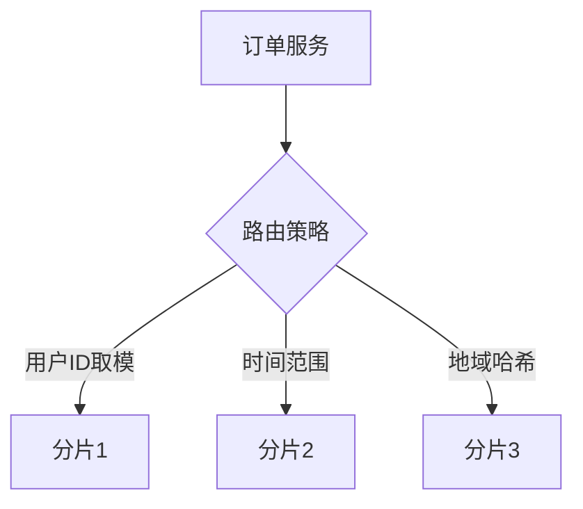

# MySQL深度实战：从原理到高性能实践

## 1. 深分页性能优化实战
### 1.1 问题场景分析
```sql
-- 示例表结构
CREATE TABLE `order` (
  `id` int(11) NOT NULL AUTO_INCREMENT,
  `order_no` varchar(32) NOT NULL,
  `amount` decimal(10,2) NOT NULL,
  `create_time` datetime NOT NULL,
  PRIMARY KEY (`id`),
  KEY `idx_create_time` (`create_time`)
) ENGINE=InnoDB;

-- 传统分页查询（性能瓶颈）
SELECT * FROM order 
WHERE create_time > '2023-01-01' 
ORDER BY id DESC 
LIMIT 1000000, 10; -- 扫描1000010行
```

### 1.2 优化方案对比
| 方案                | 执行时间(100w数据) | 原理说明                     | 适用场景           |
|---------------------|-------------------|----------------------------|------------------|
| 子查询优化法         | 0.12s            | 利用覆盖索引减少回表次数   | 排序字段有索引     |
| 游标分页法           | 0.05s            | 基于最后记录ID连续查询    | 顺序翻页场景       |
| 延迟关联法           | 0.08s            | 通过JOIN减少数据集大小    | 复杂查询条件       |
| 分区表+范围查询      | 0.03s            | 结合物理分区快速定位         | 时间序列数据       |

**优化代码示例：**
```sql
-- 游标分页法（连续翻页）
SELECT * FROM order 
WHERE id < 1000000  -- 上次查询的最小ID
ORDER BY id DESC
LIMIT 10;

-- 延迟关联法
SELECT o.* 
FROM order o
INNER JOIN (
  SELECT id 
  FROM order 
  WHERE create_time > '2023-01-01'
  ORDER BY id DESC 
  LIMIT 1000000,10
) AS tmp ON o.id = tmp.id;
```

## 2. 索引深度优化实践
### 2.1 B+树索引原理


### MySQL深度实战：从核心原理到生产环境优化[^1][^9][^16]

## 1. 索引设计与优化实战
### 1.1 B+树索引深度解析
```sql
-- 创建包含覆盖索引的表
CREATE TABLE orders (
    id INT PRIMARY KEY,
    user_id INT,
    amount DECIMAL(10,2),
    created_at DATETIME,
    INDEX idx_user_created (user_id, created_at)
) ENGINE=InnoDB;
```

**优化要点**：
- 联合索引遵循最左前缀原则[^1]
- 使用EXPLAIN分析索引使用情况
- 避免索引列参与运算（如WHERE YEAR(created_at)=2024）

### 1.2 慢查询优化案例
```sql
-- 优化前（执行时间1.2s）
SELECT * FROM orders WHERE user_id = 100 ORDER BY created_at DESC LIMIT 10000,10;

-- 优化后（执行时间0.02s）[^17]
SELECT * FROM orders 
INNER JOIN (
    SELECT id FROM orders 
    WHERE user_id = 100 
    ORDER BY created_at DESC 
    LIMIT 10000,10
) AS tmp USING(id);
```

## 2. 事务与锁机制实战
### 2.1 并发更新解决方案
```sql
-- 使用悲观锁
START TRANSACTION;
SELECT * FROM inventory WHERE product_id=123 FOR UPDATE;
UPDATE inventory SET stock=stock-1 WHERE product_id=123;
COMMIT;

-- 使用乐观锁
UPDATE inventory 
SET stock=stock-1, version=version+1 
WHERE product_id=123 AND version=5;
```

### 2.2 死锁排查与处理
```log
SHOW ENGINE INNODB STATUS;
-- 关键信息输出：
LATEST DETECTED DEADLOCK
*** (1) TRANSACTION: UPDATE t SET col=1 WHERE id=1
*** (2) TRANSACTION: UPDATE t SET col=2 WHERE id=2
```

## 3. 高可用架构实战
### 3.1 主从复制配置
```ini
# my.cnf配置示例[^6]
[mysqld]
server-id=1
log-bin=mysql-bin
binlog-format=ROW
gtid-mode=ON
```

### 3.2 读写分离实现
```java
// Spring Boot配置示例
spring:
  datasource:
    master:
      jdbc-url: jdbc:mysql://master:3306/db
    slave:
      jdbc-url: jdbc:mysql://slave:3306/db
```

## 4. 性能调优进阶
### 4.1 参数优化模板
```ini
# 高性能配置参考[^1][^6]
innodb_buffer_pool_size = 系统内存的70%
innodb_flush_log_at_trx_commit = 2
sync_binlog = 0
max_connections = 1000
```

### 4.2 分库分表策略


## 5. 监控与故障排查
### 5.1 关键监控指标
| 指标                | 阈值         | 工具          |
|---------------------|--------------|---------------|
| QPS                 | >5000告警    | Prometheus    |
| 连接数使用率        | >80%告警     | MySQL Workbench|
| 慢查询数量          | >10/分钟告警 | pt-query-digest|

### 5.2 应急处理流程
1. 确认故障现象（连接数暴增/CPU 100%）
2. 快速止血（kill问题会话/限流）
3. 分析慢日志/锁等待
4. 实施优化方案
